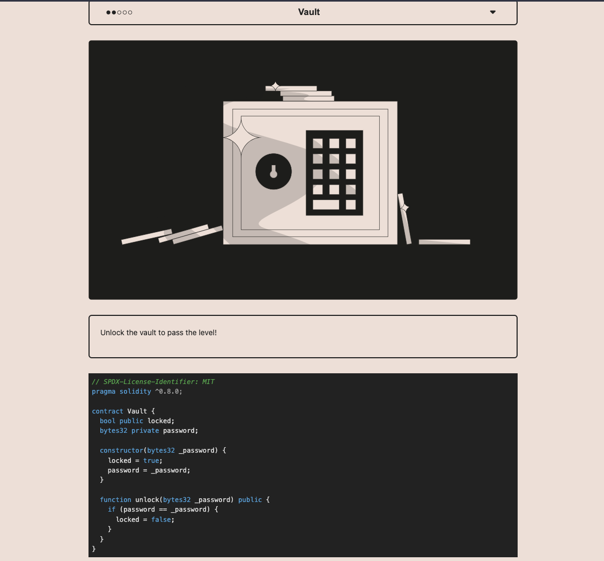
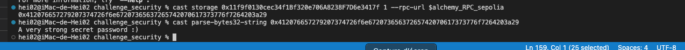
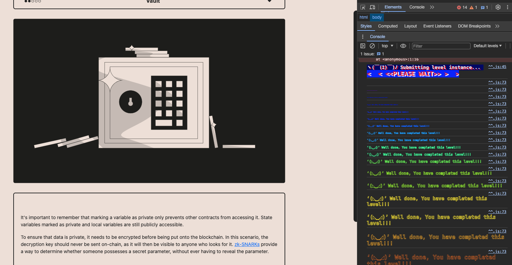

<!-- @format -->

# English README 　[Jump to Japanese Version](#japanese)

# Ethernaut Solutions

- The Ethernaut is a Web3/Solidity-based coding wargame, played in the Ethereum Virtual Machine.
- Each level is a smart contract that needs to be 'hacked'.

Here are the writeups of my solutions levels I cleared.
** I will not recommend you to look at solutions I wrote. Solve it yourself for your learning 😛 **

# How to use Ethernaut

- To use ethernaut, you need to use the console from the developper tool of your browser in the first place.
- If your confortable with Foundry and Methods call using `cast` and `send`, you can also solve problem from Foundry framework.
- If you are not confortable yet with ABI, then it is a great way to learn about it and how to call any contract by external calls.
- In higher difficulty levels, you will need to wrote smart contracts and interfaces to hack some smart contract externally for clearing levels.

## Ethernaut 8. Vault

The goal is to unlock the contract by finding the `Bytes32` password.

- The solution here is to find the value of the `private` variable `password`.

<br/>
<p align="center">

</p>
<br/>

1. Using foundry `cast` let's decrypt it.

- Read contract storage (replace contract address and environment variables):

```
cast storage 0x11f9f0130cec34f1Bf320e706A8238F7D6e3417f 1 --rpc-url $alchemy_RPC_sepolia
```

- The returned result:
  `0x412076657279207374726f6e67207365637265742070617373776f7264203a29`

- Cast the result to string if you want to see the meaning:

```
cast parse-bytes32-string 0x412076657279207374726f6e67207365637265742070617373776f7264203a29
```

2. Call the contract function to unlock the contract from the browser, passing it the `Bytes32` password.

```
contract.unlock("0x412076657279207374726f6e67207365637265742070617373776f7264203a29")
```

<br/>
<p align="center">

</p>
<br/>

1. Submit result to ethernaut.

Level is completed.

<br/>
<p align="center">

</p>
<br/>

<a name="japanese"></a>

# 日本語版の README

# Ethernaut の解決策

- Ethernaut は、Web3/Solidity ベースのコーディングウォーゲームで、Ethereum Virtual Machine (EVM) でプレイされます。
- 各レベルはハッキングする必要があるスマートコントラクトです。

これはクリアしたレベルの解決策です。
**解決策を見ることをお勧めしません。学習のために自分で解決してください 😛 **

# Ethernaut の使用方法

- Ethernaut を使用するには、まずブラウザの開発者ツールからコンソールを使用する必要があります。
- Foundry と cast および send を使用した方法の呼び出しに慣れている場合、Foundry フレームワークから問題を解決することもできます。
- まだ ABI に慣れていない場合、それを使用して任意のコントラクトを外部呼び出しで呼び出す方法について学び、理解するのに最適な方法です。
- より高難度のレベルでは、スマートコントラクトとインターフェースを作成して、いくつかのスマートコントラクトを外部からハッキングするために解レベルをクリアする必要があります。

## Ethernaut 8. Vault

コントラクトを解除する目的は、`Bytes32` パスワードを見つけることです。

- ここでの解決策は、`private` 変数 `password` の値を見つけることです。

<br/>
<p align="center">

</p>
<br/>

1. Foundry の `cast` を使用して解読しましょう。

- コントラクトのストレージを読む（コントラクトアドレスと環境変数を置き換えてください

```
cast storage 0x11f9f0130cec34f1Bf320e706A8238F7D6e3417f 1 --rpc-url $alchemy_RPC_sepolia
```

- 返された結果:
  `0x412076657279207374726f6e67207365637265742070617373776f7264203a29`

- 結果を文字列に変換して、意味を確認したい場合は以下のようにします:

```
cast parse-bytes32-string 0x412076657279207374726f6e67207365637265742070617373776f7264203a29
```

2. ブラウザからコントラクト関数を呼び出し、`Bytes32` パスワードを渡してコントラクトのロックを解除します。

```
contract.unlock("0x412076657279207374726f6e67207365637265742070617373776f7264203a29")
```

<br/>
<p align="center">

</p>
<br/>

5. 結果を ethernaut に提出します。

- レベルが完了。

<br/>
<p align="center">

</p>
<br/>
